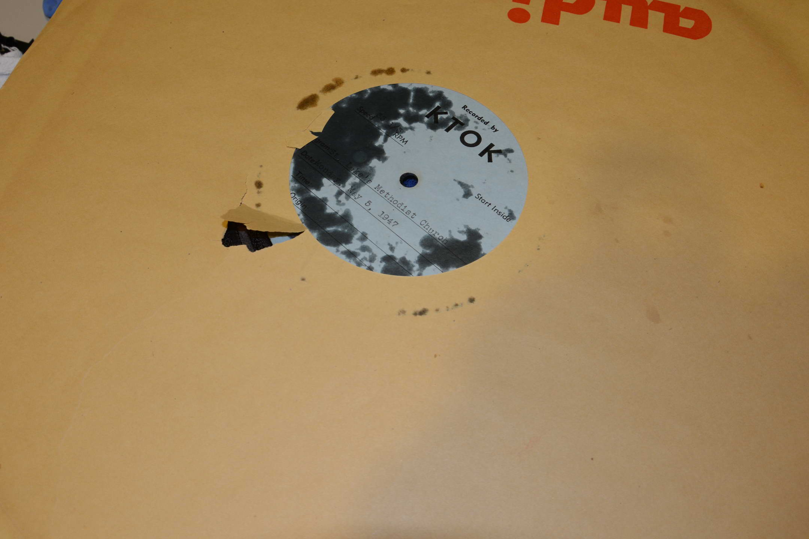
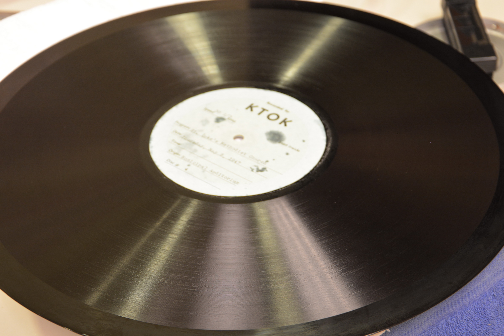
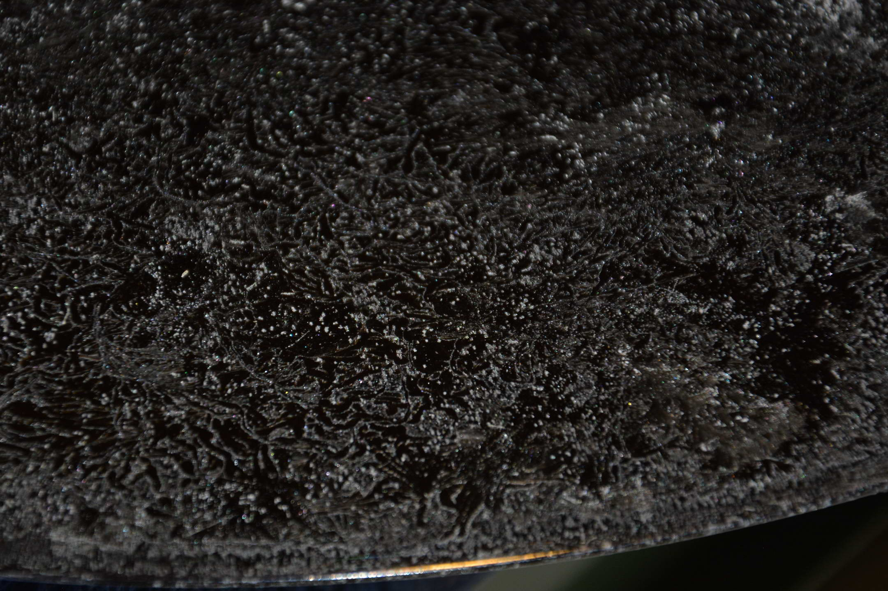
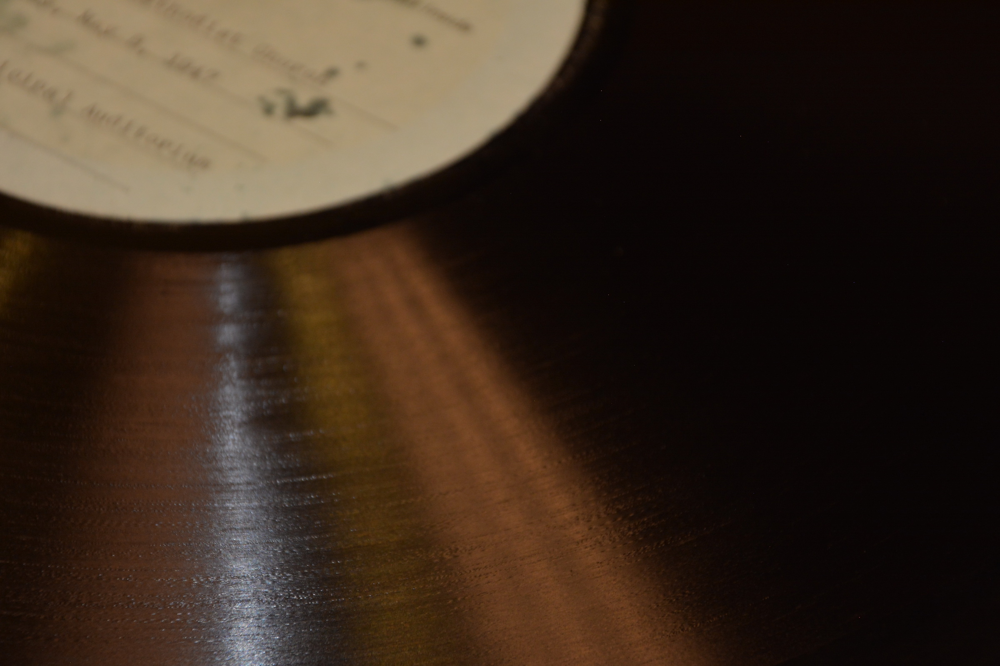

# St. Luke's Methodist Church Transcription Disc Collection
## Preservation, Conservation Methodology, and Digitization Process

**JA Pryse, PhD** — Lead Archivist & Curator

This repository documents the physical conservation and digital reformatting of a series of lacquer transcription discs recorded by radio station **KTOK** (Oklahoma City) of broadcasts from **St. Luke's Methodist Church**, May 1947. The discs are 16-inch, 33⅓ RPM, inside-start instantaneous lacquer recordings on aluminum or glass bases, recorded on-site (including the Municipal Auditorium) for delayed broadcast.

The project encompasses condition assessment, stabilization, cleaning treatment development (including the **Pryse OHS Method**), playback transfer, and full photographic documentation (51 images) of the before/during/after states of each disc.

---

## The Problem

Decades of uncontrolled environmental exposure — humidity swings, heat, cold, and improper vertical/stacked storage — produced three interacting deterioration mechanisms:

1. **Sleeve adhesion.** Original kraft-paper sleeves bonded directly to the lacquer surface, in some cases fusing with the plasticizer layer.
2. **Palmitic acid exudation.** The castor-oil plasticizer in the nitrocellulose lacquer hydrolyzed, migrating to the surface as a white, greasy crystalline deposit (palmitic/stearic acid) — the classic and most destructive failure mode of lacquer discs.
3. **Suspected mold growth** distributed through the groove field, intermixed with the acid bloom.

## Treatment Summary

| Stage | Approach | Result |
|-------|----------|--------|
| Sleeve release | Light film of mineral oil brushed onto bonded paper; dwell time; slow methodical lifting | Successful — paper released without pulling lacquer or damaging grooves |
| Test: distilled water + vinegar rinse | Applied and removed quickly to avoid attacking the lacquer | **Not effective** — surface deposits largely remained |
| **Pryse OHS Method** (full protocol) | Applied after the vinegar test and rinse | **Successful** — disc cleaned entirely; groove detail recovered for playback |

Full protocol details, materials, and safety notes are in [`docs/methodology.md`](docs/methodology.md).

## Before / After

| Before | After |
|--------|-------|
|  |  |
|  |  |

Complete captioned image inventory: [`metadata/image-captions.csv`](metadata/image-captions.csv)

## Repository Structure

```
├── README.md
├── docs/
│   ├── methodology.md          # Conservation treatment protocol (Pryse OHS Method)
│   ├── condition-report.md     # Deterioration assessment and mechanisms
│   └── digitization.md         # Playback transfer and digital preservation workflow
├── images/
│   ├── before/                 # Pre-treatment condition documentation
│   ├── process/                # Treatment in progress
│   ├── after/                  # Post-treatment results
│   └── full-series/            # Complete 51-image documentation set
└── metadata/
    └── image-captions.csv      # Captions and descriptive metadata for all images
```

## Related

- Project page: [japryse.com](https://japryse1-ja-pryse---cv.editor.wix.com) *(update to published URL)*

## Rights and Reuse

Documentation text and photographs © JA Pryse. Methodology shared for professional archival and conservation use with attribution. The underlying recordings and labels are historical materials; consult the holding repository regarding the audio content.

## Disclaimer

Lacquer disc treatment is inherently risky and disc-specific. This documentation describes treatments performed by a trained archivist on a specific collection; it is not a general instruction set. Test conservatively, work on expendable areas first, and consult an audio preservation specialist before treating unique recordings.
