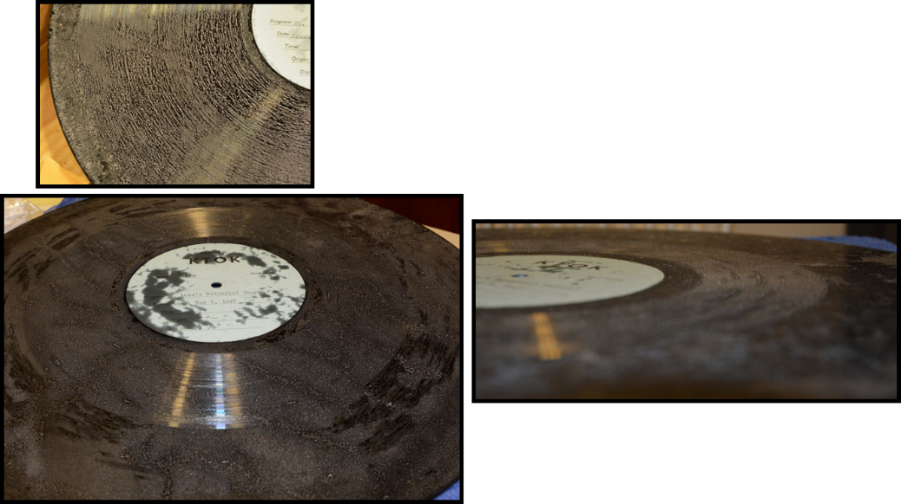
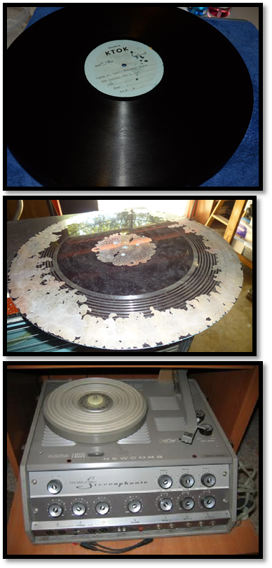
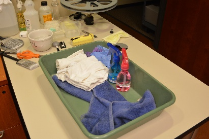
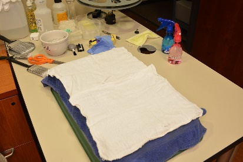
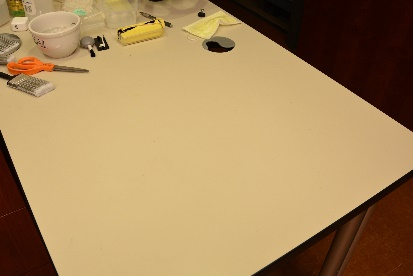

# Conservation Methodology

**Collection:** St. Luke's Methodist Church / KTOK transcription discs — 37 sixteen-inch lacquer discs (1946–1961) plus 3 wire recordings
**Format:** 16" instantaneous lacquer transcription discs, 33⅓ RPM, inside start; steel substrate with nitrocellulose (lacquer) laminate
**Conservator:** JA Pryse, PhD
**Protocol developed at:** Oklahoma Historical Society, Digitization Division

For the collection's history and project background, see [`background.md`](background.md).

---

## 1. Deterioration Mechanisms Observed

### 1.1 Environmental damage and sleeve adhesion
Fluctuating humidity, heat, cold, and improper storage over nearly eight decades caused the original kraft-paper sleeves to bond to the lacquer surface. In the worst cases the paper fused with the softened lacquer/plasticizer layer, tearing away in fragments and leaving paper residue embedded across the groove field.

### 1.2 Palmitic acid exudation
Transcription discs are prone to developing a coating of a white, waxy or greasy substance which in its early stages resembles a fine white dust or powder. This is palmitic and stearic acid — commonly shortened to "PA" in the archival community — exuded as the castor-oil plasticizer in the nitrocellulose lacquer hydrolyzes and migrates out of the coating. This is the signature failure mode of lacquer discs: beyond obscuring the grooves, plasticizer loss embrittles the coating and can lead to cracking and delamination from the base.

The early "dust" stage of palmitic acid formation is sometimes mistaken for mold; under a microscope the two are clearly distinguishable (The Audio Archive).

### 1.3 Suspected mold
White filamentous deposits consistent with mold growth were distributed through the grooves, intermixed with the acid bloom (see condition photography of Disc 6, May 6, 1947 recording). Inventory worksheets record mold, palmitic acid buildup, dust, and particulates together on the most affected discs.

### 1.4 Carrier structure and degradation factors

Lacquer (transcription, "laminate," or "direct-cut") discs consist of two components — a substrate (aluminum, steel, or glass) and a nitrocellulose laminate — and were most popular from the late 1920s through the 1940s, predating wire and magnetic tape. Principal degradation factors: surface contamination (dust, mold, foreign materials), surface delamination (heat, humidity), and human contact (finger oils). Obsolescence compounds physical risk: inaccessible formats, expensive antiquated playback equipment, and "out of sight, out of mind" neglect.

## 2. Pre-Treatment Workflow

1. **Inventory and condition reporting.** Create an inventory per institutional policy and a condition report for each disc so every handler can determine exact procedures. Photograph each angle of the disc at every phase of preservation and digitization.
2. **Relocate to a safe environment:** minimal light exposure and no direct/intense light; distance from radiators, vents, vibration, magnetic fields, televisions, and computers; 46–65°F and 30–45% RH.
3. **Condition worksheet.** Example row from this collection:

| Title | Type of material | Container damage | Fungus or mold | Bad smell | Item deformation | Needs |
|---|---|---|---|---|---|---|
| 1947_5_6 | Lacquer disc, aluminum base | Torn, fragile, molded, unsupported, fading | Mold, palmitic acid | None | Broken, chipped, PA buildup, dust, particles | Palmitic acid treatment; rehouse in archival materials |

*Additional worksheet columns: speed and diameter, misaligned holes, original format details, material sticking to disc, channels, groove deformation, coating.*

## 3. Treatment Space and Materials

The treatment station must be a safe, chemical-free, environmentally regulated area with ample room, free of damaging light, and thoroughly cleaned before setup. A clean, controlled space allows secure treatment and proper handling.

  

**Materials** (developed for smaller institutions and budget-restricted programs — common household items with only a couple of specialty pieces):

- Mineral oil
- Distilled water
- Dawn + distilled water mix
- Chamois towels (new)
- Label protector (the OHS protector was hand-made; commercial versions available)
- Multiple brushes — felt, delicate crystal brushes, and various soft-hair brushes
- Kodak Photo-Flo 200 (specialty item, readily available, under $5/bottle)
- Drying rack, vented on both sides (the OHS rack was hand-made with rotating arm; racks are available for purchase)

## 4. Treatment Sequence

### Stage 1 — Sleeve release (mineral oil method)
Removing bonded paper must be **slow and methodical** so as not to pull lacquer or damage the grooves.

1. Brush a **light film of mineral oil** onto the bonded paper.
2. Allow dwell time for the oil to penetrate and release the paper-to-lacquer bond.
3. Lift the paper gently and gradually from the disc surface. Do not force; re-apply oil and wait where resistance is felt.

Result: paper released cleanly without lacquer loss.

### Stage 2 — Tested and rejected: distilled water + vinegar
A dilute distilled water and white vinegar mixture was applied and removed quickly to limit contact time with the lacquer.

**Finding: this method is not effective.** The acid bloom and embedded deposits largely remained. The pass is documented photographically for comparison; the disc was rinsed with distilled water afterward.

*(A mild acid rinse is sometimes suggested for saponified deposits, but on this collection the results did not justify the risk of extended aqueous/acidic contact with lacquer.)*

### Stage 3 — Pryse OHS Method (full protocol)

Developed and tested at the Oklahoma Historical Society on blank/expendable transcription discs of all base types before application to collection materials. Following the vinegar test and rinse, the full protocol was applied and cleaned the disc entirely — removing the palmitic acid bloom, residual paper fibers, and surface soiling, and restoring groove definition sufficient for playback transfer.

1. Lay the disc on a brand-new soft cloth, surface, wheel, or rack. Protect the label throughout.
2. Lightly use a suction mechanism to remove loose dust and acid crystals.
3. Spray several sections of the disc with the Dawn + distilled water mix.
4. Lightly spread the mix using the softest brush (antique-crystal grade) — **1 rotation**.
5. Dab away moisture with a new chamois towel, absorbing carefully and completely.
6. Repeat steps 3–5 if necessary.
7. Lightly spray or apply mineral oil in a **very thin layer**; let sit **2 minutes**.
8. With a new felt brush, lightly apply for **2 rotations**, using a **dab motion only**.
9. With a new chamois cloth, move **in the flow of the grooves** with light pressure to remove excess oil.
10. Spray Photo-Flo 200 mix and remove excess with a new cloth.
11. Repeat steps 7–10 if necessary.
12. Spray plain distilled water (light coating) to rinse.
13. Complete the removal process until all solutions are removed.
14. Dry the disc by patting with a new chamois or microfiber cloth.
15. Place the disc on the drying rack for a **minimum of 4 hours** (rack must be vented on both sides).
16. Rehouse, digitize, store.

Cloths and brushes must be new at each application step; never reuse a contaminated cloth on the groove surface.

### Stage 4 — Post-treatment
- Final distilled-water rinse and air drying on the vented rack.
- Rehousing in inert archival sleeves; supported storage per NARA/IASA guidance.
- Photographic documentation of the cleaned surface (see `../images/after/`).
- Digitization (see [`digitization.md`](digitization.md)).

## 5. Safety and Handling Notes

- Handle lacquer discs by edges and label area only; the coating scratches far more easily than pressed shellac or vinyl.
- Glass-based lacquer discs (common in the WWII era due to aluminum restrictions) are extremely fragile — support fully at all times.
- Suspected mold: work with nitrile gloves and appropriate ventilation/PPE; isolate affected discs from the rest of the collection.
- Never soak a lacquer disc; delamination risk increases with prolonged aqueous exposure.
- Test every product and motion on expendable discs before touching collection materials.

## 6. References and Standards Consulted

- The Audio Archive, on palmitic acid identification
- University of Illinois at Urbana-Champaign, disc cleaning guidance
- IASA-TC 04, *Guidelines on the Production and Preservation of Digital Audio Objects*
- IASA-TC 05, *Handling and Storage of Audio and Video Carriers*
- Library of Congress / NEDCC guidance on lacquer disc preservation
- CLIR pub 164, *ARSC Guide to Audio Preservation*

---

*For further detailed processes, tips, and tricks — or to share improvements and innovative strategies — contact japryse@harcsm.org.*
